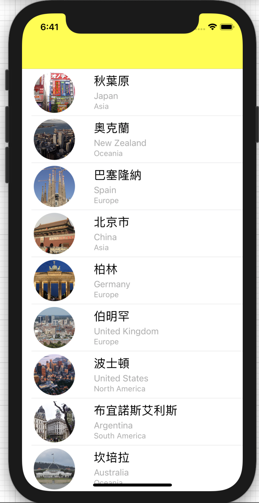

# 使用導覽控制

- 了解storyboard和segue
- 建立NavigationController
- 增加一個detailViewController
- 為DetailViewController建立一個新的Class
- 在自訂class增加變數
- 使用segues傳遞資料

```swift
//
//  ViewController.swift
//  simpleTableView
//
//  Created by t1 on 2019/1/20.
//  Copyright © 2019年 gjun. All rights reserved.
//

import UIKit

class ViewController: UITableViewController {
    
    var citys:[[String:Any]]!;
    var cityIsMarded:[Bool]!;
    
    override func viewDidLoad() {
        super.viewDidLoad()
        let bundle = Bundle.main;
        let pathURL = bundle.url(forResource: "citylist", withExtension: "plist")!;
        citys = NSArray(contentsOf: pathURL) as? [[String:Any]];
        cityIsMarded = Array(repeating: false, count: citys.count);
        
    }
    
    override func prepare(for segue: UIStoryboardSegue, sender: Any?) {
        if segue.identifier == "showCity"{
            if let indexPath = tableView.indexPathForSelectedRow{
                let destinationController = segue.destination as! CityDetailViewController;
                let city = citys[indexPath.row];
                destinationController.cityImageName = city["Image"] as? String;
                destinationController.cityName = city["City"] as? String;
            }
        }
    }
    //MARK: - UITableViewDataSource
    override func tableView(_ tableView: UITableView, numberOfRowsInSection section: Int) -> Int{
        return citys.count;
    }
    
    override func tableView(_ tableView: UITableView, cellForRowAt indexPath: IndexPath) -> UITableViewCell{
        let rowIndex = indexPath.row;
        let cityDic = citys[rowIndex];
        let cityName = cityDic["City"] as? String;
        let imageName = cityDic["Image"] as? String;
        let countryName = cityDic["Country"] as? String;
        let continentName = cityDic["Continent"] as? String;
        let cell = tableView.dequeueReusableCell(withIdentifier: "CELL", for: indexPath) as! CityCell;
        cell.cityLabel.text = cityName;
        cell.countryLabel.text = countryName;
        cell.continentLabel.text = continentName;
        cell.cityImageView.image = UIImage(named: imageName!);
        if cityIsMarded[rowIndex]{
            cell.accessoryType = .checkmark;
        }else{
            cell.accessoryType = .none;
        }
        return cell;
    }
    
    override func tableView(_ tableView: UITableView, commit editingStyle: UITableViewCell.EditingStyle, forRowAt indexPath: IndexPath){
        if editingStyle == .delete{
            citys.remove(at: indexPath.row);
            cityIsMarded.remove(at: indexPath.row);
            print("total item:\(citys.count)");
            tableView.deleteRows(at: [indexPath], with: .automatic);
        }
    }

    //MARK: - UITableViewDelegate
    /*
    override func tableView(_ tableView: UITableView, didSelectRowAt indexPath: IndexPath){
        //建立一個action sheet的選項按鈕
        let optionMenu = UIAlertController(title: nil, message: "您想要做什麼?", preferredStyle: .actionSheet);
        //在action sheet內建立一個按鈕
        let cancelAction = UIAlertAction(title: "取消", style: .cancel, handler: nil);
        optionMenu.addAction(cancelAction);
        
        //在actionSheet內建立一個call-action
        let callAction = UIAlertAction(title: "聯絡旅行社", style: .default, handler: {
            (action:UIAlertAction!)->Void in
            let alertMessage = UIAlertController(title: "連線失敗", message: "目前正在忙線中", preferredStyle: .alert);
            alertMessage.addAction(UIAlertAction(title: "OK", style: .default, handler: nil));
            self.present(alertMessage, animated: true, completion: nil);
        })
        
        optionMenu.addAction(callAction);
        
        //增加標示選項
        var titleName:String!;
        if self.cityIsMarded[indexPath.row]{
            titleName = "取消標示"
        }else{
            titleName = "標示"
        }
        
        let checkInMark = UIAlertAction(title: titleName, style: .default, handler: {
            (action:UIAlertAction) -> Void in
            let cell = tableView.cellForRow(at: indexPath);
            switch titleName{
            case "取消標示":
                cell?.accessoryType = .none;
                self.cityIsMarded[indexPath.row] = false;
            case "標示":
                cell?.accessoryType = .checkmark
                self.cityIsMarded[indexPath.row] = true;
            default:
                break;
            }
            
        })
        
        optionMenu.addAction(checkInMark);
        
        //顯示選項
        present(optionMenu, animated: true, completion: nil);
    }
 */
    
    override func tableView(_ tableView: UITableView, editActionsForRowAt indexPath: IndexPath) -> [UITableViewRowAction]?{
        let shareAction = UITableViewRowAction(style: .default, title: "分享", handler: {
            (action:UITableViewRowAction, indexPath:IndexPath) -> Void in
            let defaultText = "直接打電話給" + (self.citys[indexPath.row]["City"] as! String);
            let activityController = UIActivityViewController(activityItems: [defaultText], applicationActivities: nil);
            self.present(activityController, animated: true, completion: nil)
        })
        
        let deleteAction = UITableViewRowAction(style: .default, title: "刪除", handler: {
            (action:UITableViewRowAction, indexPath:IndexPath) -> Void in
            self.citys.remove(at: indexPath.row);
            self.cityIsMarded.remove(at: indexPath.row);
            print("total item:\(self.citys.count)");
            tableView.deleteRows(at: [indexPath], with: .automatic);
        })
        
        shareAction.backgroundColor = UIColor(red: 48.0/255.0, green: 173.0/255.0, blue: 99.0/255.0, alpha: 1.0);
        deleteAction.backgroundColor = UIColor(red: 202.0/255.0, green: 202.0/255.0, blue: 202.0/255.0, alpha: 1.0);
        
        return [shareAction, deleteAction];
    }
 
}


```

```swift
//
//  CityDetailViewController.swift
//  Navigation
//
//  Created by Robert on 2019/2/6.
//  Copyright © 2019 gjun. All rights reserved.
//

import UIKit

class CityDetailViewController: UIViewController {
    @IBOutlet var cityImageView:UIImageView!;
    var cityImageName:String?;
    var cityName:String?;
    override func viewDidLoad() {
        super.viewDidLoad()

        cityImageView.image = UIImage(named: cityImageName ?? "");
        title = cityName;
    }
    

    /*
    // MARK: - Navigation

    // In a storyboard-based application, you will often want to do a little preparation before navigation
    override func prepare(for segue: UIStoryboardSegue, sender: Any?) {
        // Get the new view controller using segue.destination.
        // Pass the selected object to the new view controller.
    }
    */

}

```

